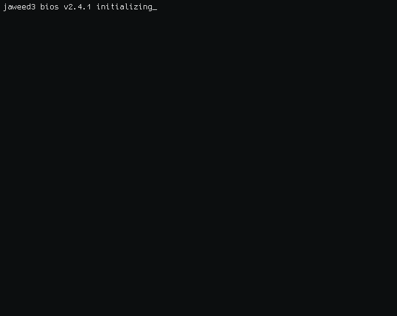
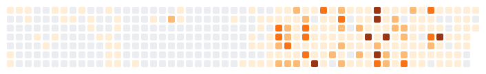

<picture>
  
</picture>

---

<picture>
  <source
    media="(prefers-color-scheme: dark)"
    srcset="dist/graph_dark.svg">
  <source
    media="(prefers-color-scheme: light)"
    srcset="dist/graph_light.svg">
  
</picture>

